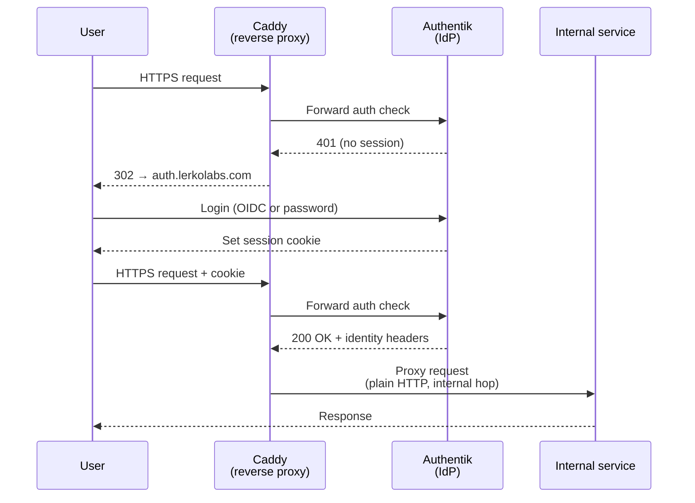

# Authentication Flow

Forward auth path for an internal service that doesn't speak OIDC natively. OIDC-native services skip the Caddy auth hop and go to Authentik directly.

## Notes

- If Authentik is down, internal services are unreachable. This is an accepted tradeoff.
