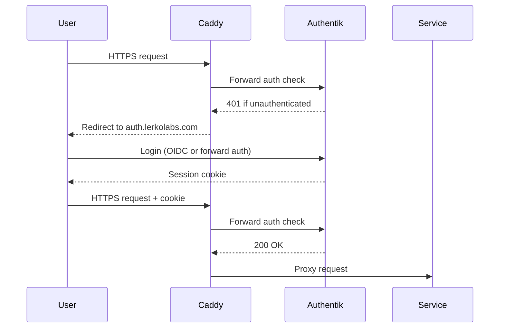

# Authentication Flow

```mermaid
sequenceDiagram
  User->>Caddy: HTTPS request
  Caddy->>Authentik: Forward auth check
  Authentik-->>Caddy: 401 if unauthenticated
  Caddy-->>User: Redirect to auth.lerkolabs.com
  User->>Authentik: Login (OIDC or forward auth)
  Authentik-->>User: Session cookie
  User->>Caddy: HTTPS request + cookie
  Caddy->>Authentik: Forward auth check
  Authentik-->>Caddy: 200 OK
  Caddy->>Service: Proxy request
```
