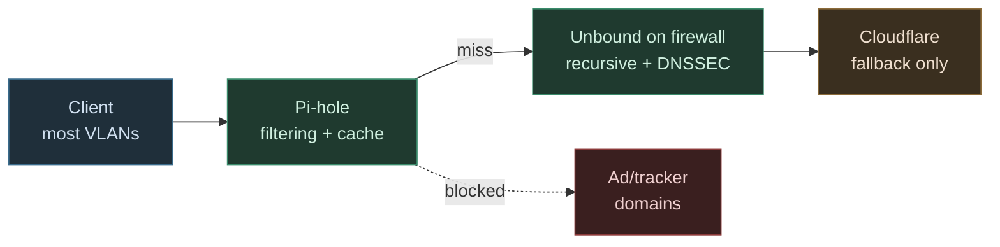
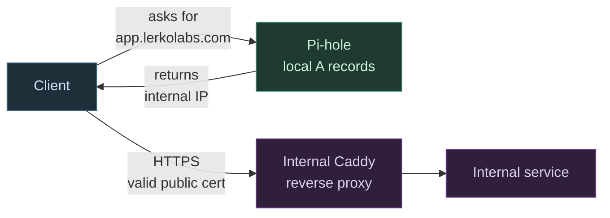

# DNS Resolution

Two flows, one resolver chain.

## External resolution

Client asks for a public domain.

## Local hostname resolution (split-horizon)

Client asks for an internal hostname. The query stays on the LAN. Pi-hole answers from local A records and the client connects to the internal reverse proxy.

