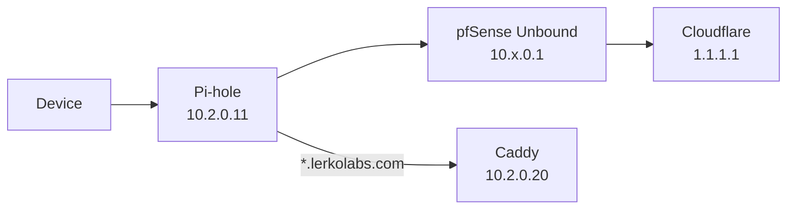

# DNS Resolution Chain

```mermaid
graph LR
  D[Device] --> PH[Pi-hole\n10.2.0.11]
  PH --> UB[pfSense Unbound\n10.x.0.1]
  UB --> CF[Cloudflare\n1.1.1.1]
  PH -- "*.lerkolabs.com" --> CADDY[Caddy\n10.2.0.20]
```
