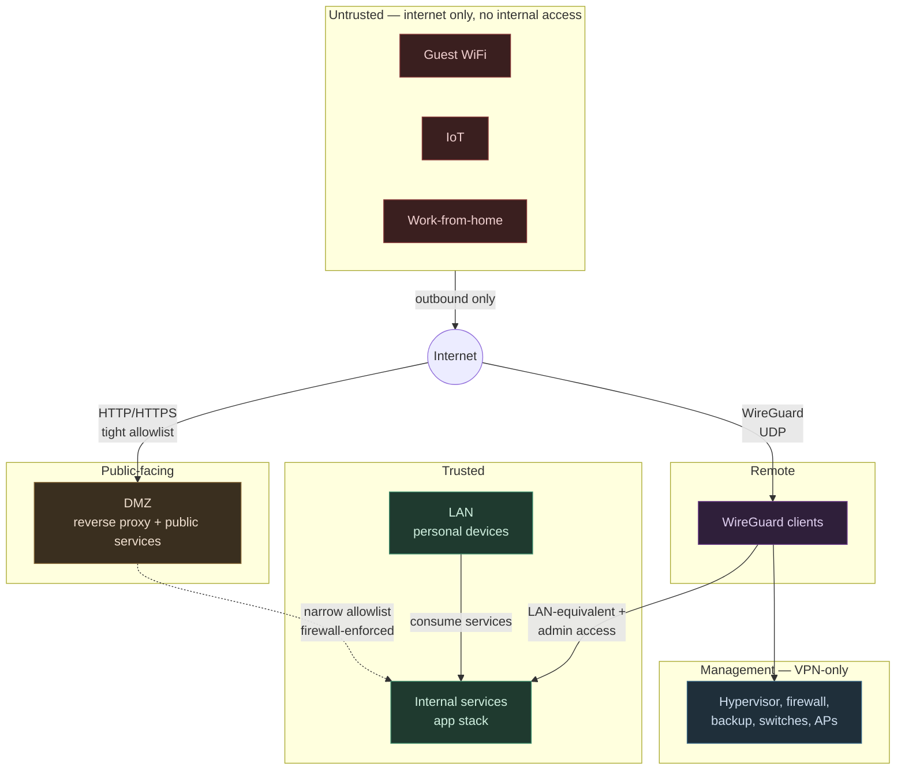
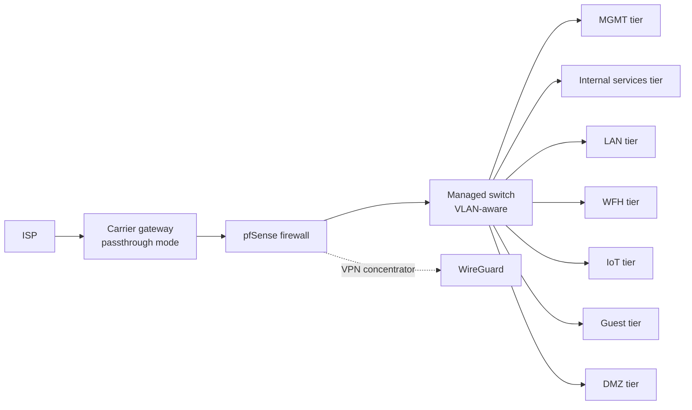

# Network Topology

Two views of the same network.

## Trust tiers and policy

Seven VLANs grouped by trust level. Edges show allowed inter-tier flows; everything else is default-deny.

## Physical flow

What plugs into what. Tier labels, not addresses.

## Two reverse proxies

The DMZ-to-internal arrow above is by design. There are two Caddy instances:

- One in DMZ, internet-facing, fronting a small set of public services.
- One in internal services tier, LAN/VPN only, fronting everything else.

## Notes

- Inter-tier policy enforced at the firewall.
