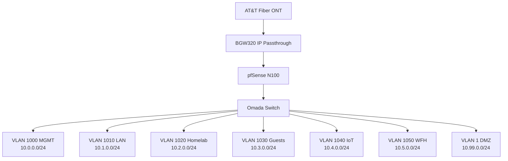

# Network Topology

```mermaid
graph TD
  ONT[AT&T Fiber ONT] --> BGW[BGW320 IP Passthrough]
  BGW --> PF[pfSense N100]
  PF --> SW[Omada Switch]
  SW --> MGMT[VLAN 1000 MGMT\n10.0.0.0/24]
  SW --> LAN[VLAN 1010 LAN\n10.1.0.0/24]
  SW --> HL[VLAN 1020 Homelab\n10.2.0.0/24]
  SW --> GUEST[VLAN 1030 Guests\n10.3.0.0/24]
  SW --> IOT[VLAN 1040 IoT\n10.4.0.0/24]
  SW --> WFH[VLAN 1050 WFH\n10.5.0.0/24]
  SW --> DMZ[VLAN 1 DMZ\n10.99.0.0/24]
```
